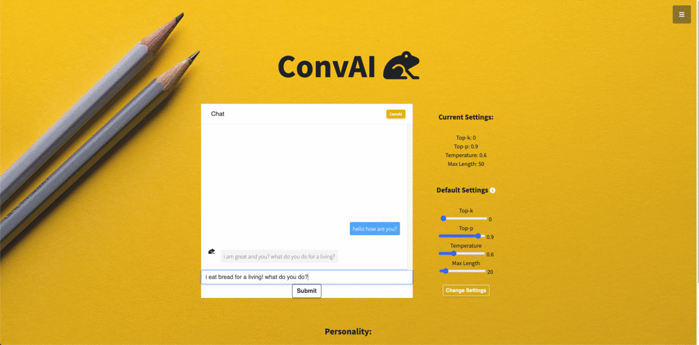
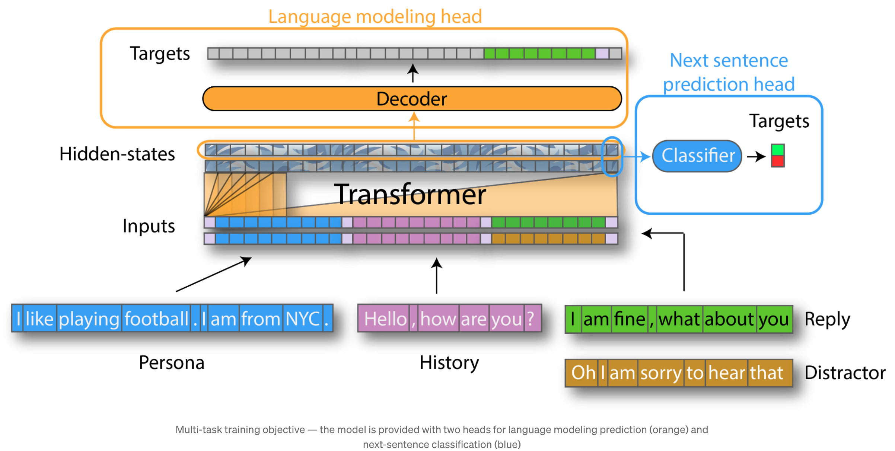

# ConvAI Smile


ConvAI Smile uses transfer learning to build a dialog agent based on OpenAI GPT. It is the author's intent to bring smiles on users via the interaction with the bot - either through interesting dialogues or the ability to uplift one's mood with some level of 'understanding'. The [original model](https://medium.com/huggingface/how-to-build-a-state-of-the-art-conversational-ai-with-transfer-learning-2d818ac26313) by HuggingFace finished 1st 🏆 in the automatic track of the Conversational Intelligence Challenge 2 [ConvAI2](http://convai.io/), a dialog competition at [NeurIPS 2018](https://nips.cc/Conferences/2018). <br>
The current model blends an addition of <b>empathy</b> and off-screen <b>movie character dialogue style</b> on top of the original model by incorporating exchanges from [counselchat](https://towardsdatascience.com/counsel-chat-bootstrapping-high-quality-therapy-data-971b419f33da) and movie scripts from [Before Sunrise Triology](https://indiegroundfilms.files.wordpress.com/2014/01/before-sunrise-numbered.pdf), an indie romance comedy.

## Demo-Preview - access Convai Smile over [here](http://206.189.79.54/)
 

## Table of contents

- [Project](#convai-smile)
- [Demo-Preview](#demo-preview)
- [Table of contents](#table-of-contents)
- [Model Architecture](#model-architecture)
- [Installation](#installation)
- [Usage](#usage)
- [Development](#development)
- [Deployment](#deployment)
- [CI/CD](#cicd)
- [Contribute](#contribute)
- [License](#license)
- [Footer](#footer)

## Model Architecture
The model uses transfer learning whereby the underlying model is the [pre-trained ConvAI GPT model](https://github.com/huggingface/transfer-learning-conv-ai) (by HuggingFace) on [PERSONA-CHAT](https://arxiv.org/abs/1801.07243), a 10k chit-chat dataset from Facebook. A few innovative features of the model include the incoporation of persona descriptions and dialogue history during training. These training inputs help with the consistency of bot personality while incorporating context of previous dialogue. To do so, token embeddings from GPT for each segment are concatenated, together with position and segment embeddings to demarcate the segment type as shown below. <br><br>
The model is termed "Double-Head" as it undergoes a multi-task training where one head will compute language modeling predictions while the other head will predict next-sentence classification labels. For more details please refer to HuggingFace's [comprehensive article](https://medium.com/huggingface/how-to-build-a-state-of-the-art-conversational-ai-with-transfer-learning-2d818ac26313) on their model training<br><br>
 <br><br>

For the updated model, two new dialogue sets are introduced. The primary motive of adding in counselchat dialogue dataset is to introduce a level of <b>quality response on mental health questions</b> by users. On the site, verified therapists respond to questions posed by users, the most helpful response will be upvoted by users. There are 31 topics ranging from depression to sleep improvement. By training the bot to give 'meaningful' replies learnt from counselchat therapists, the model hopes to bring a level of quality empathy to the bot. The next dataset is taken from scripts of movies - Before Sunrise Triology. This serves as a test to incorporate interesting dialogues and for users to <b>experience talking to on-screen characters from movies</b> they enjoy watching. One learning is to ensure scripts are taken from movies with limited characters and settings. As characters interact differently with other characters in different settings, movie dataset with too many characters and plots generally causes low model performance. <br><br>
A gridsearch is done during training to pick the best parameters. An early stop is used on language model F1 score. The selected specification are as follows:

| Specification | Details |
| ------ | ------ |
| Optimizer | Adam |
| Loss Function | Cross entropy |
| Learning rate | 4e-05 |
| Batch size | 2 |
| Epochs | 10 |
| Early Stopping | On validation F1, patience 3 |
| Language model coefficient | 2 |
| Max history | 2 |
| No. of candidates | 2 |
| Max seq. length | 128 |
| Sample size | 1877 training, 84 validation |
<br>
As a comparison against the original model score, the transfer learnt model is performing worse off - higher perplexity and lower F1. This could be attributed to the limited dataset and dialogues of a different nature. Movie dialogues and counsel chats are inherently longer due to their descriptive nature. The difficulty of prediction increases as sentences get longer and of a different context from chit-chat (counselling and movie dialogues). Nevertheless, the model still retain its original chit-chat abilities, albeit with a certain portion of empathetic responses and movie-like interesting exchanges.

| Metrics | Transfer Learning Scores | Original Scores |
| ------ | ------ | ------ |
| Perplexity | 22.5 | 20.5 |
| Language Model F1 | 0.07 | 0.165 |
| Model Loss | 3.11 | - |
| Classifer F1 | 0.78 | - |

## Installation

*Virtual environment*
- Download the git repo.

- Setup a python virtual environment on your local computer. [venv](https://docs.python.org/3/library/venv.html) is one of the options you may use to create virtual environments.

- Activate the virtual environment, navigate to the folder with the git repo and install the required dependencies 
```
pip install -r requirements.txt
```

## Usage

*Folder structure*:
```
    CONVAI_SMILE                           # Main project folder
    ├── cache_dir                          # cache folder
    │   ├── _OpenAIGPTTokenizer_eval       # saved tokens for evaluation
    │   ├── _OpenAIGPTTokenizer_interact   # saved tokens for predicting/interacting
    │   ├── _OpenAIGPTTokenizer_train      # saved tokens for training
    ├── data                               # raw datasets in .csv and .pdf and processed dataset in .json
    ├── images                             # images for README.md
    ├── model_pipeline
    │   ├── counsel_data_preprocess.py     # process counsel chat data from csv into ConvAI json format
    │   ├── model_train.py                 # implement grid search and transfer learning on dataset
    │   ├── movie_data_preprocess.py       # process movie scripts from pdf into ConvAI json format
    ├── saved_model                        # best model to be used, saved from gridsearch in json format
    ├── src
    │   ├── static                         # CSS and js for web style
    │   ├── templates                      # HTML layout for web interface
    │   ├── inference.py                   # Inference script for model predictions      
    │   ├── main.py                        # Main script which links front-end fast api with backend model
    ├── .gitignore 
    ├── README.md
    ├── requirements.txt

```
*Data Preprocessing*

For preprocessing of data, two different training sources are used.
- A counsel chat data based on online question and response by certified therapist is downloaded. The dataset and preprocessing script is adapted from https://github.com/nbertagnolli/counsel-chat To convert the counsel data into convai model format use the following command
```
python -m model_pipeline.counsel_data_preprocess --max_tokens 200 --n 3
```
where max_tokens are the max length of answer/response to be used and n is the number of randomly selected candidates to be trained against the given response. Output will be saved as json format in data file.
- Movie script dialogues are downloaded as pdf and converted into convai data format. Movie scripts with good dialogues between limited parties are preferred.
Download the movie script you want in the same pdf format. Use the following command and change the pdf_file directory name. `sel_char_1` is the characters you want in the training data, where the first character 'CELINE' will be trained as the bot response. The other characters will be
the query party. `max_tokens` are the max length of answer/response to be used, n is the number of randomly selected candidates to be trained against the given response
and `test_size` is the portion of dataset to be used for validation. Output will be saved as json format in data file. The movie_data_preprocess script will automatically append the dataset from counsel chat as well.

``` 
python -m model_pipeline.movie_data_preprocess --pdf_file './data/before-sunrise.pdf' --sel_chars_1 CELINE JESSE --max_tokens 100 --n 3 --test_size 0.2 
```


*Model Training*

- For training, a grid search through language model coefficient, learning rate and number of candidate is used to seek the model with lowest evaluation language model loss. For more understanding of the parameters being searched, refer to https://simpletransformers.ai/docs/convAI-model/.
- If you do not have GPU locally, training can be done on google colab [(sample)](https://colab.research.google.com/drive/1Dlx9aOhQ8ODyhNRHqJBKDj2GSj5FRbB4?usp=sharing).
- Use the follow command to run the training for your selected train and evaluation data set, select cuda usage and n_epochs to train for each grid search. 

```
python -m model_pipeline.model_train --train_file "data/counsel_before_sun_train.json" --eval_file "data/counsel_before_sun_val.json" --use_cuda 0 --n_epochs 10
```

*Model Inference via Web App*:
- Activate the virtual environment, navigate to the folder with the git repo and install the required dependencies
- Run locally by typing the commands in the Terminal:

```
uvicorn src.main:app
```

This will run the app on your local machine's port 8000. Copy the link into the browser or type localhost:8000 in the url.

### Deployment

*Docker*
- After running the model training, with saved model in `convai_smile/saved_model` and tokenizers in `convai_smile/cache_dir` directories, you can deploy directly with Dockers.
- If you’re not sure if you have Docker installed, you can check by running:
```
docker -v && docker-compose -v

# Docker version 19.03.5, build 633a0ea
# docker-compose version 1.24.1, build 4667896b
```

If Docker is installed on your machine, you should see the output illustrating the installed version of Docker and Docker Compose. If you need to install docker, you can refer to the [Docker official website](https://docs.docker.com/get-docker/) for more information.

The `requirements.txt` file contains the packages required for Docker image. The `Dockerfile` contains an sample of image creation.
Run the following command and the user interface should be available on `http://0.0.0.0:8000/`
```
docker build <insert directory here>/convai_smile -t convai_smile
docker run -p 8000:8000 convai_smile
```

*Deployment on DigitalOcean server*
- Link as follows: http://206.189.79.54/

- For deployment on online server (DigitalOcean), refer to these great articles [1](https://towardsdatascience.com/how-to-deploy-your-machine-learning-web-app-to-digital-ocean-64bd19ce15e2) [2](https://medium.com/intuitive-deep-learning/building-a-web-application-to-deploy-machine-learning-models-b0eb39798476)

- For future self-reference:
```
# copy codes and files to server
ssh root@206.189.79.54
git clone https://github.com/samsonleegh/convai_smile.git

# from local
scp -r /Users/samsonlee/Documents/aisg/projects/chatbot/convai_smile/saved_model root@206.189.79.54:~/convai_smile
scp -r /Users/samsonlee/Documents/aisg/projects/chatbot/convai_smile/cache_dir root@206.189.79.54:~/convai_smile

# install and run dockers container
snap install docker
sudo groupadd docker
sudo usermod -aG docker $USER

docker build -t convai_smile .
docker run -p 80:8000 convai_smile
```

